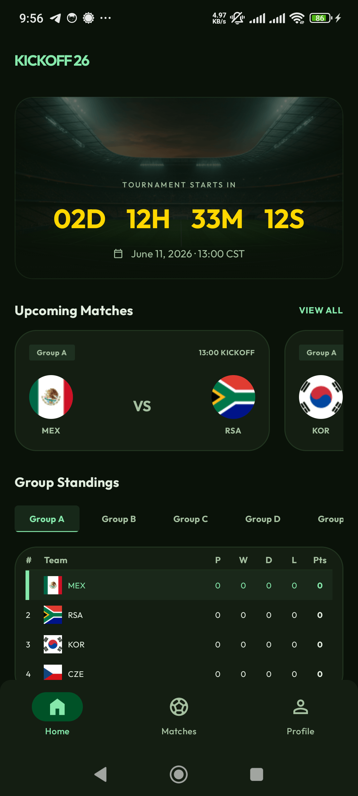
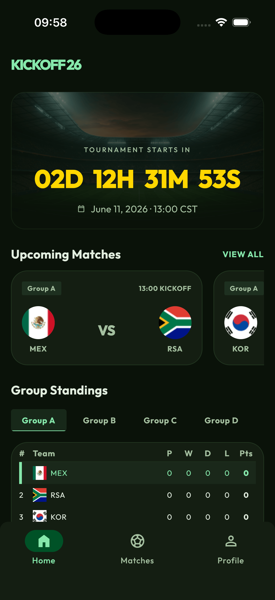

<div align="center">

# ⚽ Kickoff26

Follow group standings, matches, and a countdown to kickoff —
one shared Kotlin Multiplatform codebase for **Android** and **iOS**.


[](https://github.com/ThisIsSadeghi/KMPilot)


<sub>🟢 group standings · ⚽ live matches · ⏱️ countdown to kickoff</sub>

</div>

---

<table align="center">
  <tr>
    <td align="center"></td>
    <td align="center"></td>
  </tr>
  <tr>
    <td align="center"><sub>🤖 Android</sub></td>
    <td align="center"><sub>🍏 iOS</sub></td>
  </tr>
</table>

<p align="center"><sub>Home screen — countdown hero, upcoming matches, and live group standings. One shared codebase, native on both platforms.</sub></p>

## 📖 About

Kickoff26 is a 2026 World Cup companion app: browse group standings, track
matches with live scores, and watch the countdown to kickoff — all from one
Kotlin Multiplatform codebase shared across Android and iOS.

> 🚧 **Under active development.** Only the **Home** feature (countdown,
> upcoming matches, group standings) is implemented so far. The **Matches** and
> **Profile** tabs are placeholders — more features are on the way.

## 🚀 Powered by KMPilot

> ### 🛩️ **[KMPilot](https://github.com/ThisIsSadeghi/KMPilot)** — the engine behind everything here.
>
> A Compose Multiplatform + Clean Architecture starter that does the heavy lifting.

| | |
|---|---|
| 🧱 **Scaffolds full features** | data, presentation, DI, and navigation layers generated to spec |
| 🛡️ **Enforces architecture** | 14 critical rules, single-source-of-truth state, shared design system, no Material3 leakage |
| 🤖 **AI-assisted by design** | a Claude Code skill set (`/creating-kmp-feature`, `/modifying-kmp-feature`, `/feature-review`, `/ui-designer`, …) that generates and audits features |
| 📱 **Multiplatform from day one** | Android + iOS targets wired and ready |

Every module, pattern, and convention in this repo comes from KMPilot. To
understand how the code is organized — or to add a feature the right way — start
with the KMPilot docs and the [`CLAUDE.md`](CLAUDE.md) in this repo.

## ✨ Features

- 🟢 **Group standings** — tabbed group tables with team standings
- ⚽ **Matches** — match cards with live badges and scorelines
- ⏱️ **Countdown** to kickoff
- 🎨 **World Cup green/gold theme** via a shared X-components design system

## 🧰 Tech stack

| Area | Choice |
|------|--------|
| Language | Kotlin 2.4.0 |
| UI | Compose Multiplatform 1.11.1 |
| Targets | Android, iOS (arm64 + simulator) |
| Networking | Ktor 3.5.0 |
| DI | Koin 4.2.1 |
| Navigation | Compose Navigation 2.9.2 |
| Async | Coroutines + Flow |
| Other | kotlinx-datetime, kotlinx-serialization, immutable collections |
| JVM | 21 · compileSdk 37 · minSdk 23 |

## 🗂️ Project structure

```
composeApp/    Shared Compose app shell (App.kt, NavHost, single Scaffold)
androidApp/    Android entry point (thisissadeghi.kickoff)
iosApp/        iOS entry point (Xcode project)
core/
  common/      Either, UiState, setState, ErrorModel, UiText, locale
  data/        Ktor ApiClient + shared data plumbing
  designsystem/ X-components (XButton, XText, XScreen, XTheme …) + app/ tier
feature/
  home/        Countdown + standings + upcoming matches
```

Each feature follows Clean Architecture: `data/` (model · remote · datasource ·
repository) → `presentation/` (ViewModel · UiModel · ui) → `di/`. Features never
depend on other features.

## 🏁 Getting started

### Requirements

- JDK 21
- Android Studio (latest) or IntelliJ IDEA
- Xcode (for the iOS target)

### Build & run

```bash
# Android
./gradlew assembleDebug

# iOS — open iosApp/iosApp.xcodeproj in Xcode and run
```

### Common Gradle tasks

```bash
./gradlew :feature:home:assembleAndroidMain   # Incremental feature build
./gradlew :feature:home:desktopTest           # Run feature tests
./gradlew :feature:home:ktlintFormat          # Format
```

## 🤖 AI-assisted development

This repo ships with [Claude Code](https://claude.com/claude-code) skills for
feature scaffolding, UI design, testing, and review. Architecture conventions are
enforced through these workflows rather than written by hand.

```bash
claude
> /creating-kmp-feature   # scaffold a new feature
> /modifying-kmp-feature   # change an existing feature
> /feature-review          # audit against patterns
> /feature-test            # generate tests
> /ui-designer             # design screens in Stitch
```

Skills live in `.claude/skills/`. Architecture rules, naming conventions, and the
14 critical patterns are documented in [`CLAUDE.md`](CLAUDE.md) and
`.claude/skills/_shared/patterns.md`.

## 🏛️ Architecture highlights

- **Single source of truth state** — one `*UiModel` per screen holding plain UI
  fields + `UiState<DTO>` async slots; repositories return `Either<DTO>`.
- **Shared design system** — features use X-components, never Material3 directly.
- **Single app-shell Scaffold** — the only `Scaffold` lives in `App.kt`; feature
  screens use `XScreen`.
- **Fully localized** — every user-facing string is a Compose resource.

See `CLAUDE.md` for the full rule set.

## 🙏 Acknowledgements

**World Cup 2026 data** is powered by the open
[worldcup2026 API](https://github.com/rezarahiminia/worldcup2026) by
**[Reza Rahiminia](https://github.com/rezarahiminia)** — thank you for building
and sharing it. 🏆

---

<div align="center">

⚽ **Kickoff26**

</div>
